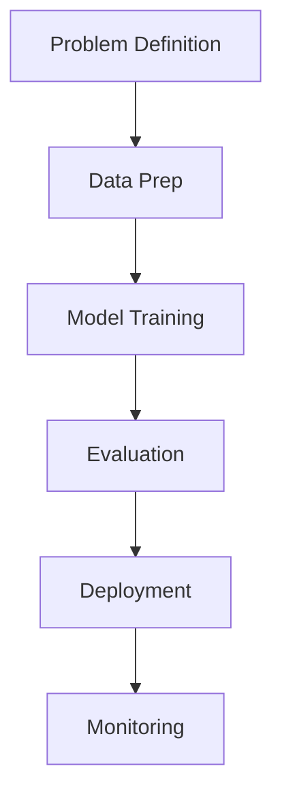

# DocumentationAI: Your AI/ML Expertise Hub 🚀

Welcome to the **DocumentationAI Docs** repository! This project is an excellent resource for understanding and leveraging the expertise of **Sasi Sundar**, an experienced AI/ML engineer specializing in developing end-to-end AI systems, NLP, computer vision, and backend integration.

## 🌟 Key Features

### 🤖 AI/ML Expertise:
- Build and optimize **Natural Language Processing (NLP)** pipelines for sentiment analysis and entity recognition.
- Implement **Computer Vision (CV)** solutions for tasks like image classification, object detection (e.g., YOLO), and segmentation.
- Design **scalable AI systems** using Python, PyTorch, and TensorFlow.

### 🛠️ Technology Stack:
- **Frameworks**: PyTorch, TensorFlow, Transformers, FastAPI
- **Tools**: Docker, Kubernetes for containerization and orchestration
- **Utilities**: Prometheus for monitoring, Jupyter Notebooks for interactive coding

### 🌍 Projects:
Explore real-world examples such as:
- NLP chatbots and sentiment analyzers
- Computer vision pipelines for real-time object detection
- Backend microservices tailored for scalable AI inference

### 📈 Approach to Development:
Sasi adopts a structured methodology that emphasizes:
1. Problem definition and success metric analysis
2. Data cleaning, augmentation, and preparation
3. Model prototyping, iterative validations, and deployment
4. Scalable production-ready solutions and monitoring



## 📘 Getting Started

Navigate resources like:
- **FAQs**: Quick answers on consulting services, technology stack, and project examples.
- **Changelogs**: Track updates on new AI/ML innovations, documentation improvements, and milestone achievements.

<Callout kind="tip">
💡 **New!** Learn how to fine-tune PyTorch models for NLP tasks and explore a sentiment analysis tool processing over 10k reviews per minute.
</Callout>

## 📑 Documentation Sections

- **[Introduction](./introduction.mdx)**: Overview of Sasi's AI/ML background.
- **[Building AI Systems](./building-ai-systems.mdx)**: Comprehensive guide to creating end-to-end AI solutions.
- **[AI/ML Concepts](./ai-ml-concepts.mdx)**: Deep-dive into machine learning fundamentals, NLP pipelines, and more.
- **[Changelog](./changelog.mdx)**: History of updates to projects, documentation, and more.

## 💬 Collaboration and Support

Sasi offers various flexible consulting options:
- Hourly freelance support for quick fixes and targeted assistance.
- Retainers for long-term AI strategy and development partnerships.
- Project-based collaboration for end-to-end solution delivery.

### How to Get in Touch?
📧 Email: contact@sasisundar.com  
📅 Schedule a discovery call: [Calendly Link](#)

<Callout kind="info">
Typical response time: Under 24 hours.
</Callout>

## 🔧 Contribution

We welcome contributions! Follow these steps:
1. Fork this repository.
2. Clone your fork and create a new branch.
3. Submit a pull request with your changes.

---

<Callout kind="alert">
Stay updated⚡! Watch this repository on GitHub, or subscribe to the RSS feed for notifications about the latest advancements and additions. Together, let’s innovate in AI/ML!
</Callout>
```
