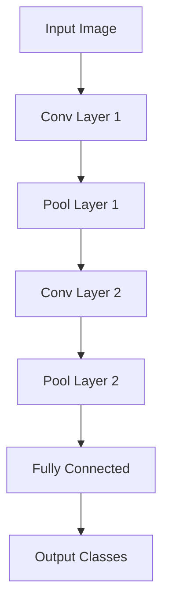

## Overview

Sasi Sundar excels in AI/ML engineering, focusing on core concepts that power intelligent systems. You encounter these fundamentals when building scalable AI solutions, from predictive models to advanced perception tasks. Explore machine learning basics, NLP pipelines, computer vision methods, and deep learning frameworks through practical examples.

<Columns cols={2}>
  <Card title="Machine Learning Fundamentals" icon="cpu" href="#machine-learning-fundamentals">
    Grasp supervised, unsupervised, and reinforcement learning essentials.
  </Card>
  <Card title="Natural Language Processing" icon="message-circle" href="#natural-language-processing">
    Process and analyze human language with tokenization and transformers.
  </Card>
  <Card title="Computer Vision Techniques" icon="image" href="#computer-vision-techniques">
    Detect objects and segment images using convolutional networks.
  </Card>
  <Card title="Deep Learning Frameworks" icon="code" href="#deep-learning-frameworks">
    Leverage PyTorch and TensorFlow for model development.
  </Card>
</Columns>

## Machine Learning Fundamentals

Machine learning forms the backbone of AI systems. You train models on data to make predictions or uncover patterns.

<Tabs>
  <Tab title="Supervised Learning" icon="check-circle">
    Use labeled data for tasks like classification and regression.
  </Tab>
  <Tab title="Unsupervised Learning" icon="activity">
    Discover hidden structures in unlabeled data via clustering.
  </Tab>
</Tabs>

<CodeGroup tabs="Python">
```python
from sklearn.ensemble import RandomForestClassifier
from sklearn.model_selection import train_test_split
from sklearn.datasets import load_iris

# Load dataset
iris = load_iris()
X_train, X_test, y_train, y_test = train_test_split(iris.data, iris.target, test_size=0.2)

# Train model
model = RandomForestClassifier(n_estimators=100)
model.fit(X_train, y_train)

# Predict
accuracy = model.score(X_test, y_test)
print(f"Accuracy: {accuracy:.2f}")
```
</CodeGroup>

<Callout kind="tip">
Split your data into train/test sets to evaluate model performance reliably.
</Callout>

## Natural Language Processing

NLP enables machines to understand text. Sasi Sundar builds pipelines for sentiment analysis and entity recognition.

<Steps>
  <Step title="Tokenize Text" icon="scissors">
    Break sentences into tokens.
  </Step>
  <Step title="Vectorize" icon="layers">
    Convert tokens to numerical vectors using embeddings.
  </Step>
  <Step title="Model and Predict" icon="zap">
    Apply transformers for tasks like classification.
  </Step>
</Steps>

```python
import torch
from transformers import pipeline

# Load pre-trained sentiment model
classifier = pipeline("sentiment-analysis")

# Analyze text
result = classifier("Sasi Sundar builds innovative AI solutions.")
print(result[0]['label'], result[0]['score'])
```

## Computer Vision Techniques

Computer vision processes images for object detection and segmentation. You use convolutional neural networks (CNNs) to extract features.



<Expandable title="Advanced CNN Details" default-open="false">
Increase filter sizes in deeper layers to capture complex patterns. Use data augmentation to prevent overfitting.
</Expandable>

## Deep Learning Frameworks

Choose frameworks based on your needs. PyTorch offers dynamic graphs for research; TensorFlow suits production.

<Tabs>
  <Tab title="PyTorch" icon="flame">
    ```python
    import torch.nn as nn

    class SimpleNet(nn.Module):
        def __init__(self):
            super().__init__()
            self.fc = nn.Linear(784, 10)

        def forward(self, x):
            return self.fc(x.view(-1, 784))
    ```
  </Tab>
  <Tab title="TensorFlow" icon="brain">
    ```python
    import tensorflow as tf

    model = tf.keras.Sequential([
        tf.keras.layers.Flatten(input_shape=(784,)),
        tf.keras.layers.Dense(10, activation='softmax')
    ])
    ```
  </Tab>
</Tabs>

<Callout kind="info">
Experiment with both frameworks to match your project's flexibility and deployment requirements.
</Callout>