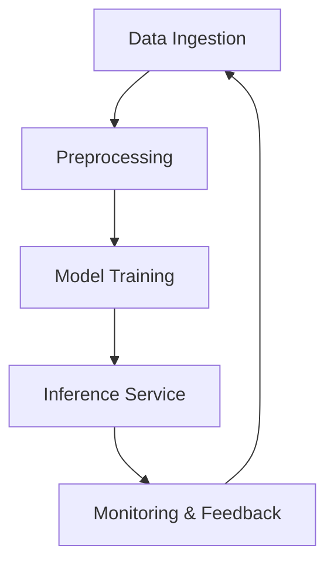

## Overview

Build complete AI systems that handle data ingestion, model training, inference, and deployment. You design scalable architectures, implement models with Python frameworks, integrate backend services, and optimize for production. This guide covers key phases from principles to deployment.

<Columns cols={3}>
  <Card title="System Design" icon="layout" href="#">
    Define architecture for data flow and scalability.
  </Card>
  <Card title="Python Implementation" icon="code" href="#">
    Train models using PyTorch or TensorFlow.
  </Card>
  <Card title="Backend Integration" icon="server" href="#">
    Connect to APIs and services for real-world use.
  </Card>
</Columns>

## System Design Principles

Follow modular design for maintainability. Break your system into data pipeline, model training, inference service, and monitoring.



<Callout kind="tip">
  Start with a minimum viable system (MVS). Prototype data flow first before scaling models.
</Callout>

| Principle       | Description                          | Benefit                  |
|-----------------|--------------------------------------|--------------------------|
| Modularity     | Separate concerns like data and model | Easier testing and updates |
| Scalability    | Use distributed training             | Handle large datasets   |
| Observability  | Log metrics and traces               | Quick issue detection    |

## Implementation with Python

Use Python for its rich ecosystem. Choose PyTorch for dynamic graphs or TensorFlow for production graphs.

<Tabs>
  <Tab title="PyTorch" icon="zap">
    Train a simple image classifier.

    <CodeGroup tabs="Model,Training">
```python
import torch
import torch.nn as nn

class SimpleCNN(nn.Module):
    def __init__(self):
        super().__init__()
        self.conv1 = nn.Conv2d(3, 32, 3)
        self.fc = nn.Linear(32 * 26 * 26, 10)

    def forward(self, x):
        x = torch.relu(self.conv1(x))
        x = x.view(-1, 32 * 26 * 26)
        return self.fc(x)
```
```python
import torch.optim as optim

model = SimpleCNN()
optimizer = optim.Adam(model.parameters(), lr=0.001)
criterion = nn.CrossEntropyLoss()

for epoch in range(10):
    for images, labels in dataloader:
        optimizer.zero_grad()
        outputs = model(images)
        loss = criterion(outputs, labels)
        loss.backward()
        optimizer.step()
```
    </CodeGroup>
  </Tab>
  <Tab title="TensorFlow" icon="cpu">
    Equivalent TensorFlow implementation.

    <CodeGroup tabs="Model,Training">
```python
import tensorflow as tf

model = tf.keras.Sequential([
    tf.keras.layers.Conv2D(32, 3, activation='relu', input_shape=(28, 28, 3)),
    tf.keras.layers.Flatten(),
    tf.keras.layers.Dense(10)
])
```
```python
model.compile(optimizer='adam', loss='sparse_categorical_crossentropy')

model.fit(train_images, train_labels, epochs=10)
```
    </CodeGroup>
  </Tab>
</Tabs>

## Backend Services Integration

Expose your model via FastAPI for inference.

<Steps>
  <Step title="Set Up FastAPI" icon="server">
    Install and create app.

````python
pip install fastapi uvicorn torch
````

```python
from fastapi import FastAPI
app = FastAPI()

@app.post("/predict")
async def predict(image: bytes):
    # Load and preprocess image
    # Run model inference
    return {"prediction": "class_5"}
```
  </Step>
  <Step title="Deploy with Uvicorn" icon="rocket">
    Run server.

```bash
uvicorn main:app --host 0.0.0.0 --port 8000
```
  </Step>
  <Step title="Test Endpoint" icon="play">
    Send request.

```bash
curl -X POST "http://localhost:8000/predict" -H "Content-Type: application/json" -d '{"image": "base64_data"}'
```
  </Step>
</Steps>

<ParamField path="image" param-type="bytes" required="true">
  Base64-encoded image data for prediction.
</ParamField>

## Testing and Optimization

Test models with unit tests and optimize for speed.

<ExpandableGroup>
  <Expandable title="Performance Tips" default-open="true">
    Use mixed precision training to reduce memory.

```python
from torch.cuda.amp import autocast

with autocast():
    outputs = model(images)
```
  </Expandable>
  <Expandable title="Testing Example">
    Validate accuracy.

```python
import pytest

def test_model_accuracy():
    assert model_accuracy > 0.85
```
  </Expandable>
</ExpandableGroup>

<Callout kind="alert">
  Monitor GPU utilization during training. Overfitting occurs if validation loss rises.
</Callout>

Deploy to cloud services like AWS SageMaker for production scaling. Track metrics with Prometheus for observability.