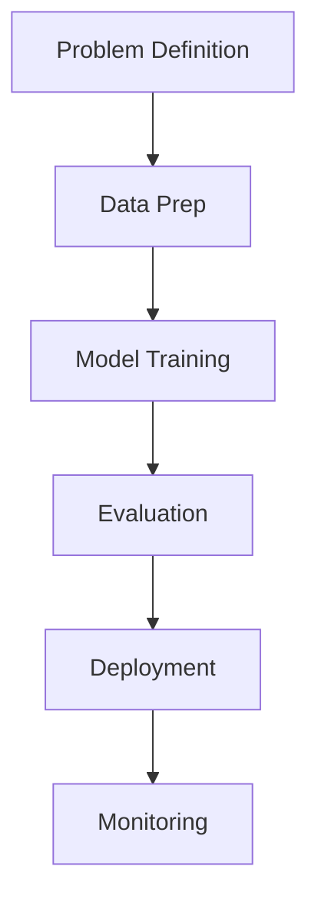

## Overview

Sasi Sundar is an experienced AI/ML engineer and developer who builds end-to-end AI systems. You benefit from his skills in machine learning, software development, and deploying scalable solutions. With a focus on Python ecosystems including PyTorch and TensorFlow, Sasi handles NLP, computer vision, and backend services efficiently.

<Callout kind="info">
  Sasi emphasizes practical, production-ready AI solutions that deliver measurable impact.
</Callout>

## Professional Background

Sasi Sundar brings years of hands-on experience in AI/ML engineering. He designs scalable AI pipelines, integrates models into production environments, and collaborates on complex projects. His work spans startups to enterprise teams, ensuring robust backend services and optimized ML workflows.

<Expandable title="Key Milestones" default-open="true">
  - Led development of NLP models for sentiment analysis in customer feedback systems.
  - Implemented computer vision pipelines for real-time object detection.
  - Built microservices with FastAPI and Docker for AI inference at scale.
</Expandable>

## Core Expertise

Explore Sasi's strengths across key AI/ML domains. Use the grid below to navigate his specialized areas.

<Columns cols={3}>
  <Card title="Machine Learning" icon="zap" href="#">
    Expertise in supervised, unsupervised, and reinforcement learning models using PyTorch and TensorFlow.
  </Card>
  <Card title="NLP" icon="message-circle" href="#">
    Tokenization, transformers, and sequence models for text processing and generation.
  </Card>
  <Card title="Computer Vision" icon="image" href="#">
    CNNs, object detection (YOLO), and image segmentation with OpenCV and PyTorch.
  </Card>
</Columns>

## Approach to Development Projects

Sasi follows a structured methodology for AI projects. You see this in his step-by-step process that ensures reliability and performance.

<Steps>
  <Step title="Problem Definition" icon="target">
    Analyze requirements and define success metrics.
  </Step>
  <Step title="Data Preparation" icon="database">
    Clean, augment, and preprocess datasets for model training.
  </Step>
  <Step title="Model Development" icon="code">
    Prototype and iterate on models with cross-validation.
  </Step>
  <Step title="Deployment & Monitoring" icon="rocket">
    Containerize with Docker, deploy via Kubernetes, and set up logging.
  </Step>
</Steps>



## Code Examples

Sasi demonstrates proficiency through practical code. Review these multi-language snippets for common tasks.

<Tabs>
  <Tab title="PyTorch Model" icon="code">
    Train a simple neural network for classification.

    <CodeGroup tabs="Python">
```python
import torch
import torch.nn as nn
import torch.optim as optim

class SimpleNet(nn.Module):
    def __init__(self):
        super().__init__()
        self.fc = nn.Linear(784, 10)

    def forward(self, x):
        return self.fc(x.view(-1, 784))

model = SimpleNet()
optimizer = optim.Adam(model.parameters(), lr=0.001)
criterion = nn.CrossEntropyLoss()
```
    </CodeGroup>
  </Tab>
  <Tab title="TensorFlow Pipeline" icon="settings">
    Build a data pipeline for image preprocessing.

    <CodeGroup tabs="Python">
```python
import tensorflow as tf

def preprocess_image(image, label):
    image = tf.cast(image, tf.float32) / 255.0
    image = tf.image.resize(image, [224, 224])
    return image, label

dataset = dataset.map(preprocess_image, num_parallel_calls=tf.data.AUTOTUNE)
```
    </CodeGroup>
  </Tab>
</Tabs>

<Callout kind="tip">
  Integrate these patterns into your projects by starting with modular, testable code.
</Callout>